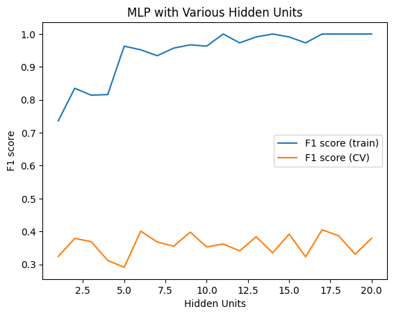

# Homework 3: Fish Finder
## Author: Lorenzo Mendoza
## Run Program
To run this program, you can either run the Python script "fishfinder.py" with set default values (or you change change parameter from the called functions) or feel free to use the Jupyter Notebook if you like "fishfinder.ipynb".

You will need to have the necessary Python libraries installed, including:
- Scikit-learn
- Keras 
- Tensorflow
- Pandas 
- Matplotlib
- NumPy
 
Once you have these libraries installed, you can run the program using any Python development environment or console.

The program consists of several functions, including the load_newts() function, which loads the dataset used in this project. To run this function, you simply need to call it with do_min_max parameter set to True or False depending on whether you want to normalize the data.

To run the Linear SVM model, you can call  the "Linear_SVM" function and adjust parameters:

```
LinearSVM(xvals, yvals, c_values= [0.0001, 0.001, 0.01, .1, 1, 10])
```

To run the Kernel SVM models, you can call either the "RBF_Slack_SVM" function:
```
RBF_Slack_SVM(xvals, yvals, c_values = [0.001, 0.01, 0.1, 1, 10, 100,1000] , k_fold=5)
```
or the "RBF_Learn_SV" function: 
```
RBF_Learn_SVM(xvals, yvals, gamma_values= [0.001, 0.01, 0.1, 1, 10, 100], k_fold=5)
```
depending on the SVM model you want to use. You can adjust the hyperparameters passed to these functions to change the range of values that will be tested during training.

To run the MLP model, you can call the mlp function :

```
mlp(xvals, yvals, hidden_units=20, activation='sigmoid', optimizer='adam',learning_rates = [0.0002,0.0005, 0.001, 0.00146, 0.01, 0.1, 1])
```

To run the sweeping MLP with hidden layers:

```
mlp_sweep(xvals, yvals, k=5, hidden_units=20, activation='sigmoid', optimizer='adam',learning_rate = 0.01):
```
Both the MLP methos have a custom built in "createMLP" and "f1_scoreK" functions.


To visualize the results, you can call the plot_svms(df1, df2, df3) function, which takes three dataframes as input and plots the results for the three SVM models. You can generate these dataframes by calling the SVM functions and passing the resulting dictionaries to the pd.DataFrame() constructor. When you call the MLP functions, they will produce the plots.

Overall, to recreate the results presented in this program, you can simply run the program with the default settings, which will use the dataset from the UCI Machine Learning Repository and test the SVM and MLP models using a range of hyperparameters.


## Part I


From our results, the following relationships were observed:

- As the value of the slack variable increases for the linear SVM, the F1 score for the complete data and CV also increase. However, the increase in the F1 score becomes less significant as the slack variable increases, and the runtime also increases.
- For the kernel SVM, increasing the slack variable generally results in an increase in F1 score, but only up to a certain point. After this point, the F1 score begins to decrease, and the runtime also increases. This is because increasing the slack variable allows for more misclassifications, but only up to a certain point before it starts to negatively impact the performance.
- The learning rate for the kernel SVM does not seem to have a significant effect on the F1 score or runtime.
- The RBF kernel SVM achieves perfect memorization for both the slack and learning rate variations, while the linear SVM does not.

When adjusting the parameters, we can observe that increasing the slack variable or learning rate generally results in an increase in runtime. However, for the RBF kernel SVM, increasing the slack variable beyond a certain point can result in a significant increase in runtime, as mentioned above.

Regarding the comparison between train and CV score, we can observe that for the linear SVM, the F1 score for the complete data is generally higher than the F1 score for the CV, indicating some overfitting. However, for the kernel SVM, we can observe that the F1 score for the complete data is significantly higher than the F1 score for the CV for the slack SVM, indicating significant overfitting. For the learning rate SVM, the F1 score for the complete data is still higher than the F1 score for the CV, but the difference is not as significant. This suggests that the learning rate SVM is less prone to overfitting compared to the slack SVM.

Overall, the RBF kernel SVM seems to perform better than the linear SVM in terms of achieving perfect memorization and achieving a higher F1 score. However, adjusting the parameters can have a significant impact on the runtime, and overfitting can occur, especially for the slack kernel SVM. Therefore, it is essential to carefully tune the parameters to achieve the best performance while avoiding overfitting.

## Part II

The best F1 score obtained on the complete dating dataset with 10 hidden units using MLP is 0.991. This was achieved with a learning rate of 0.1, 10 hidden units, 150 epochs, and a batch size of 15. The runtime for this experiment was 4.9 seconds.


To address this, the number of hidden units was increased to 20. The results showed that the F1 score on the complete data set was consistently high, with a maximum of 1.0 achieved with 11, 14, 17, 18, and 20 hidden units for the raw data, and with 1, 11, 17, 18, and 20 hidden units for the scaled data. However, the F1 score on the cross-validation data was lower and more variable, indicating that the MLP may not generalize well to new data.





To evaluate the performance of the MLP, a cross-validation method was used to sweep the number of hidden units from 1 to 20. The results showed that the MLP achieved its highest F1 score of 0.405 with 17 hidden units using a k-fold value of 10.


## Appendix


| Linear SVM     | F1 score (complete data) | F1 score (CV) | Runtime  |
| -------------- | ------------------------ | ------------- | -------- |
| slack variable |                          |               |          |
| 0.001          | 0.000                    | 0.409         | 0.064828 |
| 0.010          | 0.000                    | 0.407         | 0.041047 |
| 0.100          | 0.609                    | 0.475         | 0.045709 |
| 1.000          | 0.653                    | 0.509         | 0.047267 |
| 10.000         | 0.646                    | 0.532         | 0.050411 |
| 100.000        | 0.646                    | 0.524         | 0.052164 |


| Slack RBF-SVM  | F1 score (complete data) | F1 score (CV) | Runtime  |
| -------------- | ------------------------ | ------------- | -------- |
| slack variable |                          |               |          |
| 0.001          | 0.000                    | 0.000         | 0.059803 |
| 0.010          | 0.000                    | 0.000         | 0.057826 |
| 0.100          | 0.000                    | 0.000         | 0.065634 |
| 1.000          | 0.242                    | 0.031         | 0.057515 |
| 10.000         | 0.991                    | 0.308         | 0.066549 |
| 100.000        | 1.000                    | 0.299         | 0.069695 |

| Learning RBF-SVM | F1 score (complete data) | F1 score (CV) | Runtime  |
| ---------------- | ------------------------ | ------------- | -------- |
| learning rate    |                          |               |          |
| 0.001            | 0.000                    | 0.409         | 0.061103 |
| 0.010            | 0.000                    | 0.409         | 0.058380 |
| 0.100            | 0.129                    | 0.426         | 0.063081 |
| 1.000            | 0.991                    | 0.407         | 0.068711 |
| 10.000           | 1.000                    | 0.407         | 0.064513 |
| 100.000          | 1.000                    | 0.409         | 0.064839 |


MLP Learning

| Learning Rate | F1 score | Runtime | Best F1 score |
| ------------- | -------- | ------- | ------------- |
| 0.00020       | 0.000    | 10.2307 | 0.00000       |
| 0.00050       | 0.126    | 6.4847  | 0.00050       |
| 0.00100       | 0.556    | 9.0444  | 0.00100       |
| 0.00146       | 0.575    | 6.0975  | 0.00146       |
| 0.01000       | 0.931    | 11.3786 | 0.01000       |
| 0.10000       | 0.991    | 4.9250  | 0.10000       |
| 1.00000       | 0.000    | 4.9134  | 0.10000       |

Hidden Units = 10, Epochs = 150, Batch Size = 15

---

MLP

| Learning Rate | F1 score | Runtime | Best F1 score |
| ------------- | -------- | ------- | ------------- |
| 0.00020       | 0.024    | 5.1159  | 0.00020       |
| 0.00050       | 0.354    | 5.1283  | 0.00050       |
| 0.00100       | 0.575    | 5.2597  | 0.00100       |
| 0.00146       | 0.588    | 5.1774  | 0.00146       |
| 0.01000       | 1.000    | 6.0806  | 0.01000       |
| 0.10000       | 1.000    | 4.7468  | 0.01000       |
| 1.00000       | 0.000    | 5.3051  | 0.01000       |

Hidden Units = 20, Epochs = 150, Batch Size = 15

---

| MLP            | F1 score (complete data) | F1 score (CV) | Runtime   |
| -------------- | ------------------------ | ------------- | --------- |
| Hidden Unit(s) |                          |               |           |
| 1              | 0.736                    | 0.324         | 63.878260 |
| 2              | 0.835                    | 0.379         | 64.358826 |
| 3              | 0.814                    | 0.369         | 60.398759 |
| 4              | 0.816                    | 0.312         | 70.657130 |
| 5              | 0.963                    | 0.291         | 60.076313 |
| 6              | 0.952                    | 0.401         | 56.198037 |
| 7              | 0.934                    | 0.368         | 54.641290 |
| 8              | 0.957                    | 0.355         | 52.073329 |
| 9              | 0.967                    | 0.398         | 63.849857 |
| 10             | 0.963                    | 0.353         | 52.505161 |
| 11             | 1.000                    | 0.362         | 56.535879 |
| 12             | 0.973                    | 0.341         | 53.101493 |
| 13             | 0.991                    | 0.384         | 55.818485 |
| 14             | 1.000                    | 0.335         | 53.258291 |
| 15             | 0.991                    | 0.392         | 51.673574 |
| 16             | 0.973                    | 0.323         | 50.430875 |
| 17             | 1.000                    | 0.405         | 51.456419 |
| 18             | 1.000                    | 0.387         | 52.796555 |
| 19             | 1.000                    | 0.331         | 51.496298 |
| 20             | 1.000                    | 0.379         | 50.736512 |
